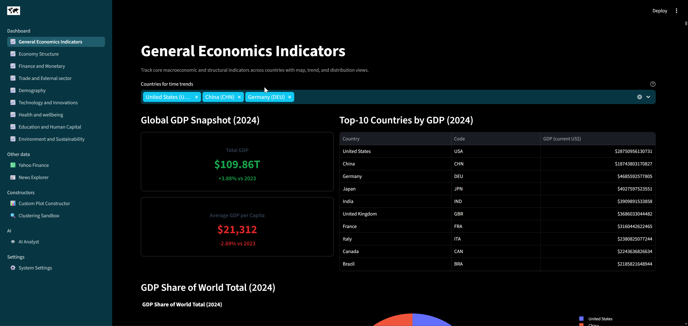
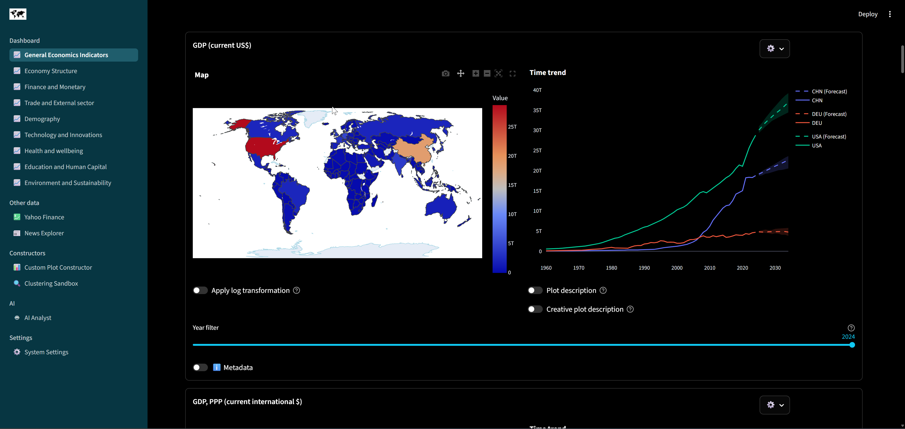
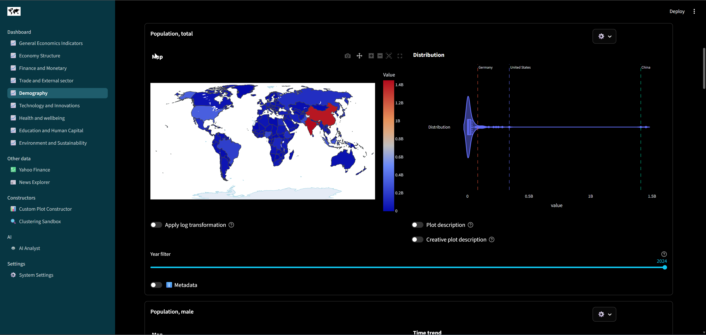
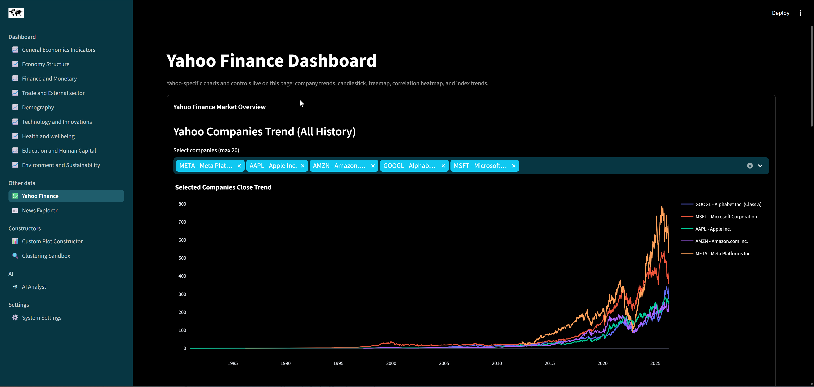
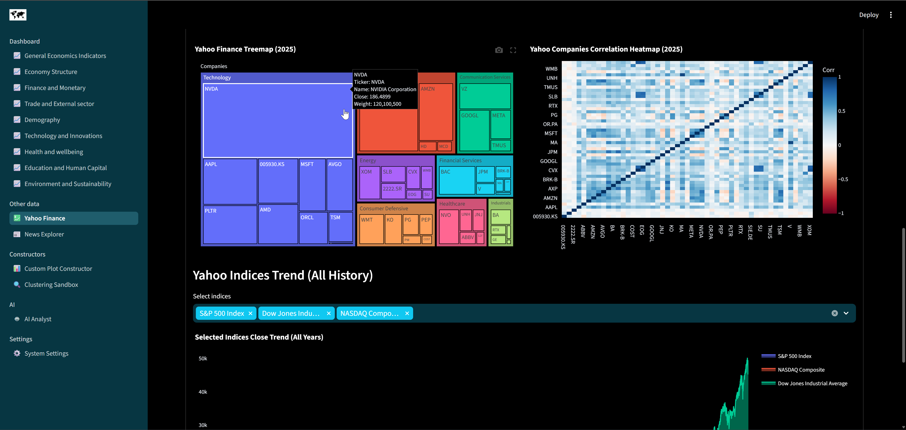
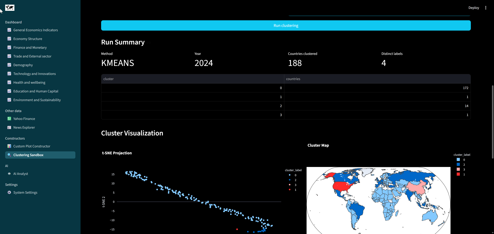

# Ultimate Macroeconomics Dashboard
Technical stack used in the application or during development (not full):


## Description
[`Ultimate Macroeconomics Dashboard`](https://github.com/alexveider1/Ultimate-Macroeconomics-Dashboard) $-$ is an AI-based intellectual system for analysing macroeconomics data in the form of interactive dashboard. Dashboard features more than **60** various indicators from [`World Bank Data API`](https://data360.worldbank.org/en/search), more than **30000** news articles from open [`Webz.io`](https://github.com/Webhose/free-news-datasets) repository and more than **50** companies and **9** indices from [`Yahoo Finance`](https://finance.yahoo.com/). Dashboard utilizes `streamlit` and `plotly` frameworks for creating fascinating visualizations (more than **60** plots) with multifunctional AI-agent, RAG, ML and much more. 

`Ultimate Macroeconomics Dashboard` uses micro-service conception and contains 10 `Docker` containers for different tasks:
* `db` $-$ container with relation DB (`PostgreSQL`) for storing data from `World Bank Data API` and `Yahoo Finance`
* `vector_db` $-$ vector DB (`Qdrant`) for storing news articles and their embeddings from `Webz.io` open news repository
* `db_init` $-$ temporal container for initializing and configuring `PostgreSQL` (`db` container)
* `downloader_general` $-$ one-time running script for download all the needed data from the the open APIs (`World Bank Data` and `Yahoo Finance`) and repository (`Webz.io`)
* `app` $-$ main container with dashboard logic itself
* `agent` $-$ backened of AI-agent wrapped as `FastAPI` service
* `forecaster` $-$ backened of time series forecasting service wrapped into `FastAPI`
* `clustering` $-$ backened of clustering service wrapped into `FastAPI`
* `downloader_extra` $-$ backened of service for downloading extra indicators (not initially included in the `_container_data\_configs\world_bank_download_config.json`) from `World Bank Data` wrapped into `FastAPI`
* `python_sandbox` $-$ backened of service for testing LLM's code in isolated and safe environment, wrapped as `FastAPI`

## Illustrations

|                          |                       |
| ------------------------ | --------------------- |
|  |  |
|     |  |
|     |  |
|     |  |
|     |  |

## LLM Requirements
As dashboard highly relates on the agentic infrastructure $-$ there are specific requirements to the LLM (they are fullfiled by almost all recent fundamental models from most popular providers: `OpenAI`, `Google`, `Anthropic`, `Qwen` and `Deepseek`) - but be carefull if either using models from other providers or using old models as some functionality might be broken. So, it is recommended to use powerfull cloud models from paid APIs. Nevertheless, you can use local ones if high-performance GPU is available via [`vLLM`](https://github.com/vllm-project/vllm), for example. List of requirements:
* Reasoning
* Tool calling
* Visual LLM, opportunity to work with images
* Long context: $\geq 256k$ (application was successfully tested on `gpt-5.4` with $1m$ context length)

## Getting started
For installation of `Ultimate Macroeconomics Dashboard` on any platform you will need `Docker`. 

If you are using device that does not support `NVIDIA CUDA`, then go to `docker-compose.yaml` and find there (at the `forecaster` service) the following part:
```yaml
    # remove `deploy` part if no GPU available
    deploy:
      resources:
        reservations:
          devices:
            - driver: nvidia
              count: all
              capabilities: [gpu]
```

Comment it or remove. 

Cloning repository (you can also download `.zip` folder with source code if `Git` is not installed on your machine):
```bash
git clone https://github.com/alexveider1/Ultimate-Macroeconomics-Dashboard
cd Ultimate-Macroeconomics-Dashboard/
```

Modify `config.yaml` at the `_container_data` folder and set base url, models for llm and for embeddings and their params in the 'shared' key:
```yaml
shared:
    ...
    openai_base_url: https://api.openai.com/v1
    openai_llm_model: gpt-5.4
    openai_embedding_model: openai/text-embedding-3-small
    openai_embedding_model_max_tokens: 8192
    openai_embedding_model_dimensions: 1536
```

Create `.env` file in the `_container_data` folder (with credentials you want and correct `OPENAI_API_KEY`):
```
POSTGRES_USERNAME=username
POSTGRES_PASSWORD=password

POSTGRES_LLM_USERNAME=llm_username
POSTGRES_LLM_PASSWORD=llm_password

QDRANT__SERVICE__API_KEY=some_api_key

OPENAI_API_KEY=some_api_key
```
**Important:** do not share these secrets with others

Start building:
```bash
docker compose up --build
```

Then wait 5-10 minutes for build of the application and approximately 1-2 hours for fetching and processing data

Go to `localhost:8501` and dashboard should appear

## Configuration

### Changing `config.yaml`
`Ultimate Macroeconomics Dashboard` is highly flexible for configurating. When deploying you can choose plenty of params: generative llm model to use, embedding model to use, llm provider (must compatible with `OpenAI API`), colors used in the dashboard, log paths and directories, models for time-series forecasting, whether to expose dashboard to the network or not. All the settings are managed through the `_container_data/config.yaml`. Default config looks the following way:

```yaml
shared:
  data_root: _container_data
  env_file: _container_data/.env
  world_bank_download_config: _configs/world_bank_download_config.json
  news_download_config: _configs/news_download_config.json
  yahoo_download_config: _configs/yahoo_download_config.json
  openai_base_url: https://api.openai.com/v1
  openai_llm_model: gpt-5.4
  openai_embedding_model: openai/text-embedding-3-small
  openai_embedding_model_max_tokens: 8192
  openai_embedding_model_dimensions: 1536
services:
  app:
    host_sync_dir: _container_data/app
  agent:
    host_sync_dir: _container_data/agent
  downloader_general:
    host_sync_dir: _container_data/downloader_general
  downloader_extra:
    host_sync_dir: _container_data/downloader_extra
  forecaster:
    host_sync_dir: _container_data/forecaster
  python_sandbox:
    host_sync_dir: _container_data/python_sandbox
  clustering:
    host_sync_dir: _container_data/clustering
postgres:
  host: db
  port: 5432
  database: postgres
qdrant:
  host: vector_db
  port: 6333
downloader_general:
  repo_url: https://github.com/Webhose/free-news-datasets.git
app:
  port: 8501
agent:
  port: 8000
forecaster:
  port: 8001
  ARIMA_AVAILABLE: true
  PROPHET_AVAILABLE: true
  CHRONOS_AVAILABLE: true
  CHRONOS_MODEL: amazon/chronos-t5-tiny
clustering:
  port: 8002
downloader_extra:
  port: 8003
python_sandbox:
  port: 8004
```

`_container_data/config.yaml` contains 11 entry points for modifications: 
* `shared` $-$ params used by all the containers. The most interesting ones are: `openai_base_url` $-$ url for preferred model provider; `openai_llm_model` $-$ model to use for generation; `openai_embedding_model` $-$ model to use for embeddings
* `services` $-$ volumes and directories for all services of the application
* `postgres` $-$ `port` $-$ port used for postgres container; `database` $-$ name of the database where all the tabular data for `Ultimate Macroeconomics Dashboard` will be stored, can be used for other needs (for research, for example) $-$ not only for the dashboard itself. Structure of `PostgreSQL` database (with field descriptions) can be found at `_container_data/database_schema.yaml`
* `qdrant` $-$ hard-coded params for `Qdrant` vector DB configuration
* `downloader_general` $-$ hard-coded params for `downloader_general` container
* `app` $-$ hard-coded params for `app` container
* `agent` $-$ hard-coded params for `agent` container
* `forecaster` $-$ `ARIMA_AVAILABLE` $-$ whether to use `arima` model (implemented at [`pmdarima`](https://github.com/alkaline-ml/pmdarima)) for time-series forecasting or not; `PROPHET_AVAILABLE` $-$ whether to use [`prophet`](https://github.com/facebook/prophet) for time series forecasting or not; `CHRONOS_AVAILABLE` whether to use [`chronos`](https://github.com/amazon-science/chronos-forecasting) for time series forecasting or not; `CHRONOS_MODEL` $-$ if `CHRONOS_AVAILABLE` is set to true then used for selecting what `chronos` model to use
* `clustering` $-$ hard-coded params for `clustering` container
* `downloader_extra` $-$ hard-coded params for `downloader_extra` container
* `python_sandbox` $-$ hard-coded params for `python_sandbox` container

**Note:** it is not recommended to change ports, path to volumes of inner services or any other hard-coded params as this requires to apply changes to the `docker-compose.yaml` as well, otherwise it will lead to the unavailability of some services or even to the fail of `docker compose` operation

### Custom theming
In order to change color palette of the dashboard you should modify `app/.streamlit/config.toml`: 
```toml
[theme]
primaryColor = "#10c8f1"
backgroundColor = "#000000"
secondaryBackgroundColor = "#073642"
textColor = "#ffffff"
```

### Hosting
In order to expose application to the external network you should also modify `app/.streamlit/config.toml` (replace `localhost` for `0.0.0.0`) at:
```toml
[server]
address = "0.0.0.0"
```
(and optionally, but recommended to set `headless` to `true`)

### Adding extra indicators
If you want to add more indicators from `World Bank Data` to be used in the dashboard you need to simply add them to the `_container_data\_configs\world_bank_download_config.json` to the corresponding key (each key is a page of the dashboard):
```json
{
    "General Economics Indicators": [
        {
            "name": "GDP",
            "id": "NY.GDP.MKTP.CD",
            "db": 2
        },
        {
            "name": "GDP_PPP",
            "id": "NY.GDP.MKTP.PP.CD",
            "db": 2
        },
        ...
    ],
    ...
```

## Correctness of data
**Important:** The developer of this dashboard is not responsible for the accuracy, completeness, or quality of the data and news displayed. All information is sourced from third-party providers and is presented as-is. It is the user's responsibility to evaluate whether any given source or data point is reliable before making decisions based on it.

## License
[](https://opensource.org/licenses/MIT)
